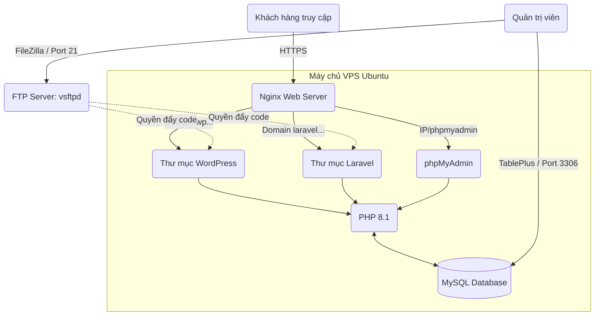

# 🚀 Hướng Dẫn Thực Chiến: Xây Dựng Hệ Thống Máy Chủ Web (LEMP Stack) Toàn Diện

**Tác giả:** Huỳnh Ngọc Diễm Ly - Technical Staff
**Mức độ:** Căn bản đến Nâng cao (Dành cho người mới bắt đầu)

Tài liệu này ghi lại toàn bộ quá trình tự tay xây dựng một máy chủ web từ con số 0. Thay vì chỉ gõ lệnh máy móc, hướng dẫn này tập trung giải thích **TẠI SAO** chúng ta lại dùng câu lệnh đó, giúp người đọc nắm vững tư duy hệ thống và bảo mật phân quyền.

---

## 🎯 PHẦN 1: ĐỀ BÀI VÀ MỤC TIÊU DỰ ÁN

### 1. Tình huống giả định (Case Study)
Khách hàng yêu cầu bạn triển khai một máy chủ (VPS) hoàn toàn mới để phục vụ cho 2 dự án web của công ty:
1. Một trang Blog công ty (Chạy bằng mã nguồn **WordPress**).
2. Một trang Ứng dụng nội bộ (Chạy bằng Framework **Laravel**).

### 2. Yêu cầu kỹ thuật khắt khe (Checklist hoàn thành)
- [x] **Core System:** Sử dụng LEMP Stack (Linux, Nginx, MySQL, PHP 8.1).
- [x] **Isolation (Cách ly):** 2 website phải chạy song song trên 2 tên miền khác nhau mà không bị xung đột.
- [x] **Security (Bảo mật):** - Có chứng chỉ SSL (Ổ khóa xanh HTTPS) cho cả 2 tên miền.
    - Áp dụng nguyên tắc "Đặc quyền tối thiểu": Mỗi web có một tài khoản Database riêng.
- [x] **Management (Quản trị):**
    - Thiết lập thành công Remote MySQL để quản lý database trực quan bằng phần mềm **TablePlus**.
    - Cài đặt **phpMyAdmin** trên trình duyệt.
- [x] **Deployment (Triển khai code):** Cấu hình FTP Server, tạo tài khoản giới hạn quyền để Dev đẩy code lên qua **FileZilla** an toàn.

### 3. Thông số môi trường thực hành
* **Hệ điều hành:** Ubuntu 22.04 LTS
* **IP Máy chủ:** `221.132.21.142`
* **Tên miền 1 (WordPress):** `wp.diemly.vietnix.tech`
* **Tên miền 2 (Laravel):** `laravel.diemly.vietnix.tech`

---

## 🔐 PHẦN 2: BẢNG QUẢN LÝ TÀI KHOẢN (CHEATSHEET)
*Lưu ý: Trong môi trường thực tế, mật khẩu phải được lưu trữ an toàn. Đây là danh sách các tài khoản đã được khởi tạo và phân quyền trong dự án này.*

| Dịch vụ | Môi trường / Công cụ | Tên đăng nhập | Mật khẩu | Chức năng (Quyền hạn) |
| :--- | :--- | :--- | :--- | :--- |
| **MySQL Root** | Terminal / TablePlus | `root` | `iwui8tKlF4CZ7rAQvyxF` | **Toàn quyền:** Quản trị toàn bộ Database (Local & Remote) |
| **WP DB** | Cấu hình web (.php) | `wp_ly` | `Ly@Vietnix2026!Wp` | **Giới hạn:** Chỉ kết nối vào `wordpress_db` |
| **Laravel DB** | Cấu hình web (.env) | `laravel_ly` | `Ly@Laravel2026!Sec` | **Giới hạn:** Chỉ kết nối vào `laravel_db` |
| **WordPress** | Trình duyệt Web | `diemly` | `Diemlyxinhdep@` | Quản trị viên (Admin) trang Blog |
| **FTP Server** | FileZilla | `diemly` | `Diemlyxinhdep@` | Đẩy code trực tiếp vào thư mục `/var/www/` |
| **phpMyAdmin**| Trình duyệt Web | `root` | `iwui8tKlF4CZ7rAQvyxF` | Quản lý Database trực quan trên web |

---

## 🏗️ PHẦN 3: KIẾN TRÚC HỆ THỐNG

Trước khi gõ lệnh, hãy nhìn vào sơ đồ dưới đây để hiểu luồng đi của dữ liệu:



---

## 🛠️ PHẦN 4: HƯỚNG DẪN TRIỂN KHAI CHI TIẾT TỪNG BƯỚC

### GIAI ĐOẠN 1: Cài đặt Nền móng (LEMP Stack)

LEMP là chữ viết tắt của Linux, Nginx (chữ E), MySQL và PHP. Đây là "tứ trụ" để chạy được web.

**1. Cập nhật hệ thống & Cài đặt Nginx (Lễ tân đón khách)**
```bash
sudo apt update
sudo apt install nginx -y
```

**2. Cài đặt Cơ sở dữ liệu (Kho lưu trữ)**
```bash
sudo apt install mysql-server -y
```

**3. Cài đặt PHP (Bộ não xử lý logic)**
```bash
sudo apt install php8.1-fpm php8.1-mysql php8.1-mbstring php8.1-xml php8.1-curl php8.1-zip -y
```
*(Giải thích: Cài thêm các đuôi `mbstring`, `xml`... vì WordPress và Laravel rất cần các tiện ích này để hoạt động ổn định).*

---

### GIAI ĐOẠN 2: Xây nhà cho Website & Phân quyền

Mỗi website cần một thư mục riêng biệt. Chúng ta sẽ tạo thư mục trong `/var/www/`.

**1. Tạo thư mục chứa code:**
```bash
sudo mkdir -p /var/www/wp.diemly.vietnix.tech
sudo mkdir -p /var/www/laravel.diemly.vietnix.tech
```

**2. Trao quyền sở hữu cho Nginx:**
Nginx hoạt động dưới một user ẩn tên là `www-data`. Bạn phải giao "sổ đỏ" các thư mục này cho nó thì nó mới có quyền đọc file web để hiển thị cho khách.
```bash
sudo chown -R www-data:www-data /var/www/wp.diemly.vietnix.tech
sudo chown -R www-data:www-data /var/www/laravel.diemly.vietnix.tech
sudo chmod -R 775 /var/www/
```

---

### GIAI ĐOẠN 3: Cấu hình "Bản đồ" cho Nginx (Virtual Host)

Nginx cần biết: *Khách gõ tên miền nào thì dẫn vào thư mục nào?*

**1. Tạo file cấu hình cho WordPress:**
```bash
sudo nano /etc/nginx/sites-available/wp.diemly.vietnix.tech
```
*Dán đoạn mã sau vào (sửa tên miền cho đúng):*
```nginx
server {
    listen 80;
    server_name wp.diemly.vietnix.tech;
    root /var/www/wp.diemly.vietnix.tech;
    
    index index.php index.html index.htm;

    location / {
        try_files $uri $uri/ /index.php?$args;
    }

    location ~ \.php$ {
        include snippets/fastcgi-php.conf;
        fastcgi_pass unix:/var/run/php/php8.1-fpm.sock;
    }
}
```

**2. Tạo cấu hình tương tự cho Laravel:**
*Lưu ý: Với Laravel, đường dẫn thư mục gốc (root) phải trỏ vào đuôi `/public`.*

**3. Kích hoạt và kiểm tra lỗi:**
```bash
# Tạo lối tắt để kích hoạt web
sudo ln -s /etc/nginx/sites-available/wp.diemly.vietnix.tech /etc/nginx/sites-enabled/

# Kiểm tra xem file cấu hình có bị gõ sai cú pháp nào không
sudo nginx -t

# Khởi động lại Nginx để áp dụng
sudo systemctl restart nginx
```

---

### GIAI ĐOẠN 4: Cài đặt SSL (Ổ khóa xanh bảo mật)

Sử dụng Certbot để tự động xin chứng chỉ miễn phí từ Let's Encrypt.
```bash
sudo apt install certbot python3-certbot-nginx -y

# Xin chứng chỉ tự động 
sudo certbot --nginx -d wp.diemly.vietnix.tech -d laravel.diemly.vietnix.tech
```

---

### GIAI ĐOẠN 5: Setup Database & Remote MySQL (Bảo mật cao)

**1. Mở cửa hệ thống mạng cho MySQL (Remote):**
```bash
sudo nano /etc/mysql/mysql.conf.d/mysqld.cnf
```
* Tìm dòng `bind-address = 127.0.0.1` và sửa thành `bind-address = 0.0.0.0`
* Khởi động lại: `sudo systemctl restart mysql`

**2. Tạo User & Phân quyền chuẩn mực (Vào Terminal gõ `mysql`):**
```sql
-- Cấp quyền Remote cho Admin (Được truy cập mọi nơi bằng dấu %)
CREATE USER 'root'@'%' IDENTIFIED BY 'iwui8tKlF4CZ7rAQvyxF';
GRANT ALL PRIVILEGES ON *.* TO 'root'@'%' WITH GRANT OPTION;

-- Tạo Database và User bị giới hạn cho ứng dụng
CREATE DATABASE wordpress_db;
CREATE USER 'wp_ly'@'localhost' IDENTIFIED BY 'Ly@Vietnix2026!Wp';
GRANT ALL PRIVILEGES ON wordpress_db.* TO 'wp_ly'@'localhost';

FLUSH PRIVILEGES;
EXIT;
```

---

### GIAI ĐOẠN 6: Thiết lập luồng đẩy Code (FTP Server)

Dùng để Dev kéo thả file lên Server thay vì dùng lệnh thủ công.

**1. Cài đặt vsftpd và tạo User chuyên dụng:**
```bash
sudo apt install vsftpd -y
sudo useradd -m diemly
sudo passwd diemly
```

**2. Phân quyền đẩy code:**
Tuyệt đối không dùng tài khoản root cho FTP. User `diemly` cần được thêm vào nhóm `www-data` để có quyền ghi đè file web.
```bash
sudo usermod -aG www-data diemly
sudo systemctl restart vsftpd
```

---

### GIAI ĐOẠN 7: Cài đặt phpMyAdmin

**1. Tải và cài đặt:**
```bash
sudo apt install phpmyadmin -y
```
*(Lưu ý: Bảng chọn Web server hiện ra, KHÔNG chọn Apache hay Lighttpd, nhấn phím Tab xuống OK rồi Enter).*

**2. Tạo lối tắt để truy cập qua IP:**
```bash
sudo ln -s /usr/share/phpmyadmin /var/www/html/phpmyadmin
```

**3. Cấu hình Nginx file Default để đọc PHP:**
```bash
sudo nano /etc/nginx/sites-available/default
```
Sửa nội dung `index` và thêm khối `location ~ \.php$` tương tự như file cấu hình WordPress ở Giai đoạn 3.

---

## 🏆 TỔNG KẾT
Hoàn thành dự án này, bạn không chỉ biết cài đặt một máy chủ Web hoạt động trơn tru mà còn áp dụng thành thạo nguyên tắc **Least Privilege (Đặc quyền tối thiểu)**: Tách biệt User Database, tách biệt User FTP để đảm bảo hệ thống luôn an toàn trước các cuộc tấn công.

